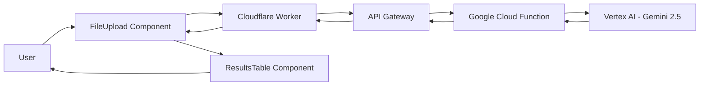

# Lab Result Extraction Implementation Plan

## Overview
Implementation plan for extracting lab test results from PDF and image files using Google Cloud Functions with Gemini 2.5 Flash, integrated with an Astro frontend.

## Architecture Overview



## Implementation Status

### ✅ Completed
1. **Backend Repository Setup** - Created at `/Users/theyoonery/Code/tyl-lab/`
2. **Google Cloud Function** - Deployed with Gemini 2.0 Flash integration
3. **API Gateway** - Configured with API key authentication
4. **Cloudflare Worker Integration** - Astro API route proxies to API Gateway
5. **API Key Management** - Secure storage in Cloudflare Worker environment variables
6. **FileUpload Component** - Multi-file support with validation and loading states
7. **ResultsTable Component** - Dynamic display with CSV export functionality
8. **Vertex AI Permissions** - Service account granted aiplatform.user role
9. **End-to-End Testing** - Full flow working from UI to Gemini extraction

### 📋 Deployment Notes
- API Gateway URL and API key stored as Cloudflare Worker secrets
- After deployment, secrets must be re-added via `wrangler secret put` or dashboard
- Worker hosts both Astro site and API endpoint in single deployment

## Repository Structure

### Frontend Repository: `/Users/theyoonery/Code/tyl/`
Existing Astro application with Cloudflare deployment.

### Backend Repository: `/Users/theyoonery/Code/tyl-lab/`
New TypeScript-based Google Cloud Function for HIPAA-compliant lab processing.

---

## Part 1: Google Cloud Function Repository Setup

### Directory Structure
```
/Users/theyoonery/Code/tyl-lab/
├── src/
│   ├── index.ts                 # Main Cloud Function entry point
│   ├── config/
│   │   └── gemini.config.ts     # Gemini model configuration
│   ├── services/
│   │   ├── gemini.ts           # Vertex AI Gemini integration
│   │   └── fileProcessor.ts    # PDF/image processing logic
│   ├── types/
│   │   └── labResults.ts       # TypeScript interfaces
│   └── utils/
│       ├── validation.ts       # Input validation
│       ├── errorHandler.ts     # Error handling utilities
│       └── prompts.ts          # Gemini prompt templates
├── tests/
│   └── fixtures/               # Test files and data
├── .env.example                # Environment template
├── .gcloudignore              # GCP deployment exclusions
├── .gitignore                 # Git exclusions
├── package.json               # Dependencies
├── tsconfig.json              # TypeScript config
├── README.md                  # Documentation
└── deploy.sh                  # Deployment script
```

### Core Files Implementation

#### 1. `package.json`
```json
{
  "name": "tyl-lab-extractor",
  "version": "1.0.0",
  "description": "HIPAA-compliant lab result extraction using Gemini 2.5",
  "main": "lib/index.js",
  "scripts": {
    "build": "tsc",
    "watch": "tsc --watch",
    "start": "npm run build && functions-framework --target=extractLabs --port=8080",
    "test": "jest",
    "deploy": "npm run build && gcloud functions deploy extractLabs",
    "deploy:prod": "npm run build && ./deploy.sh production"
  },
  "dependencies": {
    "@google-cloud/functions-framework": "^3.3.0",
    "@google-cloud/vertexai": "^1.1.0",
    "pdf-parse": "^1.1.1",
    "sharp": "^0.33.0",
    "zod": "^3.22.0"
  },
  "devDependencies": {
    "@types/node": "^20.11.0",
    "@types/pdf-parse": "^1.1.4",
    "typescript": "^5.3.0",
    "jest": "^29.7.0",
    "@types/jest": "^29.5.0",
    "ts-jest": "^29.1.0"
  }
}
```

#### 2. `tsconfig.json`
```json
{
  "compilerOptions": {
    "target": "ES2022",
    "module": "commonjs",
    "lib": ["ES2022"],
    "outDir": "./lib",
    "rootDir": "./src",
    "strict": true,
    "esModuleInterop": true,
    "skipLibCheck": true,
    "forceConsistentCasingInFileNames": true,
    "resolveJsonModule": true,
    "declaration": true,
    "declarationMap": true,
    "sourceMap": true,
    "noUnusedLocals": true,
    "noUnusedParameters": true,
    "noImplicitReturns": true,
    "noFallthroughCasesInSwitch": true
  },
  "include": ["src/**/*"],
  "exclude": ["node_modules", "lib", "tests"]
}
```

#### 3. `src/types/labResults.ts`
```typescript
export interface TestResult {
  test_name: string;
  result: string;
  unit?: string;
  reference_range?: string;
  in_range?: boolean;
  note?: string;
  flag?: 'H' | 'L' | 'C' | null; // High, Low, Critical
}

export interface LabPanel {
  panel_name: string;
  date?: string;
  provider?: string;
  tests: TestResult[];
}

export interface ExtractionResult {
  success: boolean;
  panels: LabPanel[];
  metadata?: {
    patient_id?: string;
    collection_date?: string;
    report_date?: string;
    lab_name?: string;
  };
  errors?: string[];
}

export interface ProcessedFile {
  filename: string;
  mimeType: string;
  size: number;
  result: ExtractionResult;
}

export interface BatchExtractionRequest {
  files: Array<{
    filename: string;
    content: string; // base64 encoded
    mimeType: string;
  }>;
  requestId: string;
  timestamp: number;
}

export interface BatchExtractionResponse {
  requestId: string;
  results: ProcessedFile[];
  processingTime: number;
  errors: string[];
}
```

#### 4. `src/index.ts`
```typescript
import { HttpFunction } from '@google-cloud/functions-framework';
import { Request, Response } from 'express';
import { z } from 'zod';
import { processFiles } from './services/fileProcessor';
import { handleError } from './utils/errorHandler';
import { validateRequest } from './utils/validation';
import { BatchExtractionRequest, BatchExtractionResponse } from './types/labResults';

// CORS configuration for HIPAA compliance
const ALLOWED_ORIGINS = process.env.ALLOWED_ORIGINS?.split(',') || ['https://www.trackyourlabs.com'];
const MAX_FILES = 20;
const MAX_FILE_SIZE = 50 * 1024 * 1024; // 50MB

export const extractLabs: HttpFunction = async (req: Request, res: Response) => {
  // Set CORS headers
  const origin = req.headers.origin;
  if (origin && ALLOWED_ORIGINS.includes(origin)) {
    res.setHeader('Access-Control-Allow-Origin', origin);
  }
  res.setHeader('Access-Control-Allow-Methods', 'POST, OPTIONS');
  res.setHeader('Access-Control-Allow-Headers', 'Content-Type');
  res.setHeader('Access-Control-Max-Age', '3600');

  // Handle preflight
  if (req.method === 'OPTIONS') {
    res.status(204).send('');
    return;
  }

  // Only allow POST
  if (req.method !== 'POST') {
    res.status(405).json({ error: 'Method not allowed' });
    return;
  }

  // Set security headers (HIPAA compliance)
  res.setHeader('X-Content-Type-Options', 'nosniff');
  res.setHeader('X-Frame-Options', 'DENY');
  res.setHeader('Cache-Control', 'no-store, no-cache, must-revalidate, private');
  res.setHeader('Pragma', 'no-cache');
  res.setHeader('Expires', '0');

  try {
    // Validate request
    const validationResult = await validateRequest(req);
    if (!validationResult.success) {
      res.status(400).json({ error: validationResult.error });
      return;
    }

    const requestData = validationResult.data as BatchExtractionRequest;
    
    // Process files
    const startTime = Date.now();
    const results = await processFiles(requestData.files);
    const processingTime = Date.now() - startTime;

    // Prepare response
    const response: BatchExtractionResponse = {
      requestId: requestData.requestId,
      results,
      processingTime,
      errors: results.filter(r => !r.result.success).map(r => r.filename)
    };

    // Log metrics (no PHI)
    console.log('Processing complete', {
      requestId: requestData.requestId,
      filesProcessed: results.length,
      processingTime,
      successCount: results.filter(r => r.result.success).length
    });

    res.status(200).json(response);
  } catch (error) {
    const errorResponse = handleError(error);
    res.status(errorResponse.status).json(errorResponse.body);
  }
};
```

#### 5. `src/services/gemini.ts`
```typescript
import { VertexAI } from '@google-cloud/vertexai';
import { ExtractionResult, LabPanel } from '../types/labResults';
import { getExtractionPrompt } from '../utils/prompts';

const PROJECT_ID = process.env.GCP_PROJECT_ID || '';
const LOCATION = process.env.VERTEX_AI_LOCATION || 'us-central1';
const MODEL = 'gemini-2.0-flash-exp';

// Initialize Vertex AI
const vertexAI = new VertexAI({
  project: PROJECT_ID,
  location: LOCATION,
});

const generativeModel = vertexAI.getGenerativeModel({
  model: MODEL,
  generationConfig: {
    maxOutputTokens: 8192,
    temperature: 0.1, // Low temperature for consistent extraction
    topP: 0.95,
    topK: 40,
  },
  safetySettings: [
    {
      category: 'HARM_CATEGORY_HATE_SPEECH',
      threshold: 'BLOCK_NONE',
    },
    {
      category: 'HARM_CATEGORY_DANGEROUS_CONTENT',
      threshold: 'BLOCK_NONE',
    },
    {
      category: 'HARM_CATEGORY_SEXUALLY_EXPLICIT',
      threshold: 'BLOCK_NONE',
    },
    {
      category: 'HARM_CATEGORY_HARASSMENT',
      threshold: 'BLOCK_NONE',
    },
  ],
});

export async function extractLabResults(
  fileContent: string,
  mimeType: string
): Promise<ExtractionResult> {
  try {
    const prompt = getExtractionPrompt();
    
    // Prepare the content based on file type
    const parts = [
      { text: prompt },
      {
        inlineData: {
          mimeType,
          data: fileContent, // base64 encoded
        },
      },
    ];

    const result = await generativeModel.generateContent({
      contents: [{ role: 'user', parts }],
    });

    const response = result.response;
    const text = response.text();

    // Parse JSON response
    const jsonMatch = text.match(/```json\n([\s\S]*?)\n```/);
    const jsonString = jsonMatch ? jsonMatch[1] : text;
    
    try {
      const parsedData = JSON.parse(jsonString);
      return {
        success: true,
        panels: parsedData.panels || [parsedData],
        metadata: parsedData.metadata,
        errors: [],
      };
    } catch (parseError) {
      console.error('Failed to parse Gemini response:', parseError);
      return {
        success: false,
        panels: [],
        errors: ['Failed to parse extraction results'],
      };
    }
  } catch (error) {
    console.error('Gemini extraction error:', error);
    return {
      success: false,
      panels: [],
      errors: [error instanceof Error ? error.message : 'Unknown extraction error'],
    };
  }
}
```

#### 6. `src/utils/prompts.ts`
```typescript
export function getExtractionPrompt(): string {
  return `You are a medical lab result extraction specialist. Extract all laboratory test results from the provided document and return them in a structured JSON format.

IMPORTANT INSTRUCTIONS:
1. Extract ALL test results found in the document
2. Group tests by their panel/category name
3. Include test name, result value, units, reference ranges, and whether the result is in range
4. Flag abnormal results (H for high, L for low, C for critical)
5. Include any notes or comments associated with tests
6. Extract metadata like collection date, report date, patient ID (if visible), and lab name

Return the data in this exact JSON structure:
{
  "panels": [
    {
      "panel_name": "Panel or Category Name",
      "date": "YYYY-MM-DD if available",
      "provider": "Provider name if available",
      "tests": [
        {
          "test_name": "Test Name",
          "result": "Numeric or text result",
          "unit": "mg/dL, etc.",
          "reference_range": "Range as shown in report",
          "in_range": true/false,
          "flag": "H/L/C or null",
          "note": "Any additional notes"
        }
      ]
    }
  ],
  "metadata": {
    "patient_id": "ID if visible",
    "collection_date": "YYYY-MM-DD",
    "report_date": "YYYY-MM-DD",
    "lab_name": "Laboratory name"
  }
}

CRITICAL: 
- Extract EVERY test result, even if there are hundreds
- Preserve exact values and units as shown
- If a value is marked with * or flagged, include that information
- For calculated values, include "(calc)" in the unit field
- Return ONLY valid JSON, no additional text`;
}
```

#### 7. `deploy.sh`
```bash
#!/bin/bash

# Deployment script for GCP Cloud Function
set -e

# Configuration
PROJECT_ID="your-gcp-project-id"
FUNCTION_NAME="extractLabs"
REGION="us-central1"
RUNTIME="nodejs20"
MEMORY="2048MB"
TIMEOUT="540s"
MAX_INSTANCES="100"
MIN_INSTANCES="0"

# Build TypeScript
echo "Building TypeScript..."
npm run build

# Deploy function
echo "Deploying to Google Cloud Functions..."
gcloud functions deploy $FUNCTION_NAME \
  --gen2 \
  --runtime=$RUNTIME \
  --region=$REGION \
  --source=. \
  --entry-point=$FUNCTION_NAME \
  --trigger-http \
  --allow-unauthenticated \
  --memory=$MEMORY \
  --timeout=$TIMEOUT \
  --max-instances=$MAX_INSTANCES \
  --min-instances=$MIN_INSTANCES \
  --set-env-vars="GCP_PROJECT_ID=$PROJECT_ID,VERTEX_AI_LOCATION=$REGION" \
  --project=$PROJECT_ID

echo "Deployment complete!"
echo "Function URL: https://$REGION-$PROJECT_ID.cloudfunctions.net/$FUNCTION_NAME"
```

---

## Part 2: Frontend Updates (`/Users/theyoonery/Code/tyl/`)

### New Components to Create

#### 1. Update `src/components/FileUpload.astro`
```astro
---
export interface Props {
  id?: string;
  maxFiles?: number;
  maxSizePerFile?: number;
}

const { 
  id = 'file-upload',
  maxFiles = 20,
  maxSizePerFile = 50 * 1024 * 1024 // 50MB
} = Astro.props;
---

<div class="file-upload-container">
  <div class="upload-area" id={id}>
    <svg class="upload-icon" xmlns="http://www.w3.org/2000/svg" fill="none" viewBox="0 0 24 24" stroke="currentColor">
      <path stroke-linecap="round" stroke-linejoin="round" stroke-width="1.5" d="M7 16a4 4 0 01-.88-7.903A5 5 0 1115.9 6L16 6a5 5 0 011 9.9M15 13l-3-3m0 0l-3 3m3-3v12" />
    </svg>
    
    <h3 class="upload-title">Drop your lab results here</h3>
    
    <p class="upload-subtitle">PDF or images • Up to {maxFiles} files • Max {maxSizePerFile / (1024 * 1024)}MB each</p>
    
    <input 
      type="file" 
      id={`${id}-input`} 
      accept=".pdf,image/png,image/jpeg,image/jpg" 
      class="hidden" 
      multiple
    />
    
    <div class="upload-features">
      <span>Always anonymous</span>
      <span class="separator">•</span>
      <span>HIPAA-compliant</span>
      <span class="separator">•</span>
      <span>Results in 30 seconds</span>
    </div>
  </div>

  <!-- File list -->
  <div id={`${id}-file-list`} class="file-list hidden"></div>
  
  <!-- Upload button -->
  <button id={`${id}-upload-btn`} class="upload-btn hidden">
    Process Lab Results
  </button>
</div>

<style>
  /* Previous styles... */
  
  .file-list {
    margin-top: 1rem;
    border: 1px solid #e5e7eb;
    border-radius: 8px;
    padding: 1rem;
    max-height: 200px;
    overflow-y: auto;
  }

  .file-item {
    display: flex;
    justify-content: space-between;
    align-items: center;
    padding: 0.5rem;
    background: #f9fafb;
    border-radius: 4px;
    margin-bottom: 0.5rem;
  }

  .file-item:last-child {
    margin-bottom: 0;
  }

  .file-info {
    display: flex;
    align-items: center;
    gap: 0.5rem;
  }

  .file-size {
    color: #6b7280;
    font-size: 0.875rem;
  }

  .file-remove {
    cursor: pointer;
    color: #ef4444;
    font-weight: 500;
  }

  .upload-btn {
    margin-top: 1rem;
    width: 100%;
    padding: 0.75rem 1.5rem;
    background: #3b82f6;
    color: white;
    border: none;
    border-radius: 8px;
    font-size: 1rem;
    font-weight: 500;
    cursor: pointer;
    transition: background 0.2s;
  }

  .upload-btn:hover {
    background: #2563eb;
  }

  .upload-btn:disabled {
    background: #9ca3af;
    cursor: not-allowed;
  }

  .hidden {
    display: none;
  }
</style>

<script define:vars={{ id, maxFiles, maxSizePerFile }}>
  function initFileUpload(id, maxFiles, maxSizePerFile) {
    const uploadArea = document.getElementById(id);
    const fileInput = document.getElementById(`${id}-input`);
    const fileList = document.getElementById(`${id}-file-list`);
    const uploadBtn = document.getElementById(`${id}-upload-btn`);
    
    if (!uploadArea || !fileInput || !fileList || !uploadBtn) return;
    
    let selectedFiles = [];

    // Enable transitions after initial render
    setTimeout(() => {
      uploadArea.classList.add('transitions-ready');
    }, 100);

    uploadArea.addEventListener('click', () => {
      fileInput.click();
    });

    uploadArea.addEventListener('dragover', (e) => {
      e.preventDefault();
      uploadArea.classList.add('dragover');
    });

    uploadArea.addEventListener('dragleave', () => {
      uploadArea.classList.remove('dragover');
    });

    uploadArea.addEventListener('drop', (e) => {
      e.preventDefault();
      uploadArea.classList.remove('dragover');
      
      const files = e.dataTransfer?.files;
      if (files && files.length > 0) {
        handleFiles(files);
      }
    });

    fileInput.addEventListener('change', () => {
      if (fileInput.files && fileInput.files.length > 0) {
        handleFiles(fileInput.files);
      }
    });

    function handleFiles(files) {
      const validTypes = ['application/pdf', 'image/png', 'image/jpeg', 'image/jpg'];
      const newFiles = [];

      for (let i = 0; i < files.length; i++) {
        const file = files[i];
        
        // Validate file type
        if (!validTypes.includes(file.type)) {
          alert(`${file.name} is not a valid file type. Please upload PDF or image files.`);
          continue;
        }

        // Validate file size
        if (file.size > maxSizePerFile) {
          alert(`${file.name} exceeds the maximum size of ${maxSizePerFile / (1024 * 1024)}MB.`);
          continue;
        }

        // Check max files limit
        if (selectedFiles.length + newFiles.length >= maxFiles) {
          alert(`Maximum ${maxFiles} files allowed.`);
          break;
        }

        newFiles.push(file);
      }

      if (newFiles.length > 0) {
        selectedFiles = [...selectedFiles, ...newFiles];
        updateFileList();
      }
    }

    function updateFileList() {
      if (selectedFiles.length === 0) {
        fileList.classList.add('hidden');
        uploadBtn.classList.add('hidden');
        return;
      }

      fileList.classList.remove('hidden');
      uploadBtn.classList.remove('hidden');

      fileList.innerHTML = selectedFiles.map((file, index) => `
        <div class="file-item">
          <div class="file-info">
            <span>${file.name}</span>
            <span class="file-size">(${formatFileSize(file.size)})</span>
          </div>
          <span class="file-remove" data-index="${index}">Remove</span>
        </div>
      `).join('');

      // Add remove handlers
      fileList.querySelectorAll('.file-remove').forEach(btn => {
        btn.addEventListener('click', (e) => {
          const index = parseInt(e.target.dataset.index);
          selectedFiles.splice(index, 1);
          updateFileList();
        });
      });
    }

    function formatFileSize(bytes) {
      if (bytes < 1024) return bytes + ' B';
      if (bytes < 1024 * 1024) return (bytes / 1024).toFixed(1) + ' KB';
      return (bytes / (1024 * 1024)).toFixed(1) + ' MB';
    }

    uploadBtn.addEventListener('click', async () => {
      if (selectedFiles.length === 0) return;

      uploadBtn.disabled = true;
      uploadBtn.textContent = 'Processing...';

      try {
        // Convert files to base64
        const fileData = await Promise.all(selectedFiles.map(async (file) => {
          const content = await fileToBase64(file);
          return {
            filename: file.name,
            content: content.split(',')[1], // Remove data:type;base64, prefix
            mimeType: file.type
          };
        }));

        // Send to API
        const response = await fetch('/api/extract-labs', {
          method: 'POST',
          headers: {
            'Content-Type': 'application/json',
          },
          body: JSON.stringify({
            files: fileData,
            requestId: generateRequestId(),
            timestamp: Date.now()
          })
        });

        if (!response.ok) {
          throw new Error(`HTTP error! status: ${response.status}`);
        }

        const data = await response.json();
        
        // Dispatch custom event with results
        window.dispatchEvent(new CustomEvent('lab-results', { 
          detail: data 
        }));

        // Reset form
        selectedFiles = [];
        updateFileList();
        uploadBtn.textContent = 'Process Lab Results';
      } catch (error) {
        console.error('Upload error:', error);
        alert('Failed to process files. Please try again.');
        uploadBtn.textContent = 'Process Lab Results';
      } finally {
        uploadBtn.disabled = false;
      }
    });

    function fileToBase64(file) {
      return new Promise((resolve, reject) => {
        const reader = new FileReader();
        reader.readAsDataURL(file);
        reader.onload = () => resolve(reader.result);
        reader.onerror = error => reject(error);
      });
    }

    function generateRequestId() {
      return `req_${Date.now()}_${Math.random().toString(36).substr(2, 9)}`;
    }
  }

  document.addEventListener('DOMContentLoaded', () => {
    initFileUpload(id, maxFiles, maxSizePerFile);
  });
</script>
```

#### 2. Create `src/components/ResultsTable.astro`
```astro
---
export interface Props {
  id?: string;
}

const { id = 'results-table' } = Astro.props;
---

<div id={id} class="results-container hidden">
  <div class="results-header">
    <h2>Lab Results</h2>
    <button id={`${id}-clear`} class="clear-btn">Clear Results</button>
  </div>
  
  <div id={`${id}-content`} class="results-content">
    <!-- Results will be dynamically inserted here -->
  </div>

  <div class="results-actions">
    <button id={`${id}-export`} class="export-btn">
      Export to CSV
    </button>
  </div>
</div>

<style>
  .results-container {
    margin-top: 3rem;
    padding: 2rem;
    background: white;
    border-radius: 16px;
    box-shadow: 0 1px 3px rgba(0, 0, 0, 0.1);
  }

  .results-header {
    display: flex;
    justify-content: space-between;
    align-items: center;
    margin-bottom: 1.5rem;
  }

  .results-header h2 {
    font-size: 1.5rem;
    font-weight: 600;
    color: #111827;
  }

  .clear-btn {
    padding: 0.5rem 1rem;
    background: #f3f4f6;
    color: #374151;
    border: none;
    border-radius: 6px;
    font-size: 0.875rem;
    cursor: pointer;
    transition: background 0.2s;
  }

  .clear-btn:hover {
    background: #e5e7eb;
  }

  .results-content {
    min-height: 200px;
  }

  .panel {
    margin-bottom: 2rem;
    border: 1px solid #e5e7eb;
    border-radius: 8px;
    overflow: hidden;
  }

  .panel-header {
    padding: 1rem;
    background: #f9fafb;
    font-weight: 600;
    cursor: pointer;
    display: flex;
    justify-content: space-between;
    align-items: center;
  }

  .panel-header:hover {
    background: #f3f4f6;
  }

  .panel-body {
    padding: 1rem;
  }

  .test-table {
    width: 100%;
    border-collapse: collapse;
  }

  .test-table th {
    text-align: left;
    padding: 0.75rem;
    background: #f9fafb;
    font-weight: 600;
    font-size: 0.875rem;
    color: #374151;
    border-bottom: 1px solid #e5e7eb;
  }

  .test-table td {
    padding: 0.75rem;
    border-bottom: 1px solid #f3f4f6;
  }

  .test-table tr:last-child td {
    border-bottom: none;
  }

  .test-value {
    font-weight: 500;
  }

  .test-value.high {
    color: #dc2626;
    font-weight: 600;
  }

  .test-value.low {
    color: #2563eb;
    font-weight: 600;
  }

  .test-value.critical {
    color: #dc2626;
    font-weight: 700;
    background: #fef2f2;
    padding: 0.25rem 0.5rem;
    border-radius: 4px;
  }

  .test-flag {
    display: inline-block;
    padding: 0.125rem 0.375rem;
    border-radius: 4px;
    font-size: 0.75rem;
    font-weight: 600;
    margin-left: 0.5rem;
  }

  .test-flag.high {
    background: #fef2f2;
    color: #dc2626;
  }

  .test-flag.low {
    background: #eff6ff;
    color: #2563eb;
  }

  .test-flag.critical {
    background: #dc2626;
    color: white;
  }

  .test-note {
    font-size: 0.875rem;
    color: #6b7280;
    font-style: italic;
    margin-top: 0.25rem;
  }

  .results-actions {
    margin-top: 2rem;
    display: flex;
    justify-content: flex-end;
    gap: 1rem;
  }

  .export-btn {
    padding: 0.75rem 1.5rem;
    background: #10b981;
    color: white;
    border: none;
    border-radius: 6px;
    font-weight: 500;
    cursor: pointer;
    transition: background 0.2s;
  }

  .export-btn:hover {
    background: #059669;
  }

  .hidden {
    display: none;
  }
</style>

<script define:vars={{ id }}>
  function initResultsTable(id) {
    const container = document.getElementById(id);
    const content = document.getElementById(`${id}-content`);
    const clearBtn = document.getElementById(`${id}-clear`);
    const exportBtn = document.getElementById(`${id}-export`);
    
    if (!container || !content || !clearBtn || !exportBtn) return;

    let currentResults = null;

    // Listen for lab results
    window.addEventListener('lab-results', (event) => {
      const data = event.detail;
      currentResults = data;
      displayResults(data);
      container.classList.remove('hidden');
    });

    clearBtn.addEventListener('click', () => {
      content.innerHTML = '';
      container.classList.add('hidden');
      currentResults = null;
    });

    exportBtn.addEventListener('click', () => {
      if (!currentResults) return;
      exportToCSV(currentResults);
    });

    function displayResults(data) {
      if (!data.results || data.results.length === 0) {
        content.innerHTML = '<p>No results found.</p>';
        return;
      }

      const html = data.results.map(file => {
        if (!file.result.success) {
          return `<div class="panel">
            <div class="panel-header">${file.filename} - Failed to process</div>
          </div>`;
        }

        return file.result.panels.map(panel => `
          <div class="panel">
            <div class="panel-header">
              <span>${panel.panel_name}</span>
              ${panel.date ? `<span>${panel.date}</span>` : ''}
            </div>
            <div class="panel-body">
              <table class="test-table">
                <thead>
                  <tr>
                    <th>Test Name</th>
                    <th>Result</th>
                    <th>Reference Range</th>
                    <th>Status</th>
                  </tr>
                </thead>
                <tbody>
                  ${panel.tests.map(test => {
                    const flagClass = test.flag ? test.flag.toLowerCase() : '';
                    const valueClass = test.in_range === false ? (test.flag === 'C' ? 'critical' : flagClass) : '';
                    
                    return `
                      <tr>
                        <td>
                          ${test.test_name}
                          ${test.note ? `<div class="test-note">${test.note}</div>` : ''}
                        </td>
                        <td class="test-value ${valueClass}">
                          ${test.result} ${test.unit || ''}
                          ${test.flag ? `<span class="test-flag ${flagClass}">${test.flag}</span>` : ''}
                        </td>
                        <td>${test.reference_range || '-'}</td>
                        <td>${test.in_range === false ? '⚠️ Out of range' : '✓ Normal'}</td>
                      </tr>
                    `;
                  }).join('')}
                </tbody>
              </table>
            </div>
          </div>
        `).join('');
      }).join('');

      content.innerHTML = html;
    }

    function exportToCSV(data) {
      const rows = [['File', 'Panel', 'Test Name', 'Result', 'Unit', 'Reference Range', 'Status', 'Flag', 'Note']];
      
      data.results.forEach(file => {
        if (file.result.success) {
          file.result.panels.forEach(panel => {
            panel.tests.forEach(test => {
              rows.push([
                file.filename,
                panel.panel_name,
                test.test_name,
                test.result,
                test.unit || '',
                test.reference_range || '',
                test.in_range === false ? 'Out of range' : 'Normal',
                test.flag || '',
                test.note || ''
              ]);
            });
          });
        }
      });

      const csv = rows.map(row => row.map(cell => `"${cell}"`).join(',')).join('\n');
      const blob = new Blob([csv], { type: 'text/csv' });
      const url = URL.createObjectURL(blob);
      const a = document.createElement('a');
      a.href = url;
      a.download = `lab-results-${new Date().toISOString().split('T')[0]}.csv`;
      a.click();
      URL.revokeObjectURL(url);
    }
  }

  document.addEventListener('DOMContentLoaded', () => {
    initResultsTable(id);
  });
</script>
```

#### 3. Update `src/pages/api/extract-labs.ts` to use Cloudflare Worker
```typescript
import type { APIRoute } from 'astro';

// Use Cloudflare Worker as proxy (API key is stored securely in Worker)
const WORKER_URL = import.meta.env.PUBLIC_WORKER_URL || 'https://tyl-www.workers.dev/api/extract-labs';

export const POST: APIRoute = async ({ request }) => {
  try {
    // Get request body
    const body = await request.json();
    
    // Validate request
    if (!body.files || !Array.isArray(body.files)) {
      return new Response(JSON.stringify({ error: 'Invalid request: files array required' }), {
        status: 400,
        headers: {
          'Content-Type': 'application/json',
        },
      });
    }

    if (body.files.length === 0) {
      return new Response(JSON.stringify({ error: 'No files provided' }), {
        status: 400,
        headers: {
          'Content-Type': 'application/json',
        },
      });
    }

    if (body.files.length > 20) {
      return new Response(JSON.stringify({ error: 'Maximum 20 files allowed' }), {
        status: 400,
        headers: {
          'Content-Type': 'application/json',
        },
      });
    }

    // Forward to Cloudflare Worker (which proxies to API Gateway)
    const response = await fetch(WORKER_URL, {
      method: 'POST',
      headers: {
        'Content-Type': 'application/json',
      },
      body: JSON.stringify(body),
    });

    if (!response.ok) {
      const error = await response.text();
      return new Response(JSON.stringify({ error: `Processing failed: ${error}` }), {
        status: response.status,
        headers: {
          'Content-Type': 'application/json',
        },
      });
    }

    const data = await response.json();
    
    return new Response(JSON.stringify(data), {
      status: 200,
      headers: {
        'Content-Type': 'application/json',
        'Cache-Control': 'no-store, no-cache, must-revalidate, private',
      },
    });
  } catch (error) {
    console.error('API error:', error);
    return new Response(JSON.stringify({ error: 'Internal server error' }), {
      status: 500,
      headers: {
        'Content-Type': 'application/json',
      },
    });
  }
};
```

#### 4. Update `src/pages/index.astro`
```astro
---
import Layout from '../layouts/Layout.astro';
import Footer from '../components/Footer.astro';
import FileUpload from '../components/FileUpload.astro';
import ResultsTable from '../components/ResultsTable.astro';

export const prerender = false;
---

<Layout title="Track Your Labs - Upload Lab Results">
  <main class="flex-1">
    <!-- Hero Section -->
    <div class="min-h-screen bg-base-100 pt-16">
      <div class="text-center">
        <div class="max-w-5xl mx-auto px-4">
          <h1 class="text-5xl font-bold mb-4">Track Your Labs</h1>
          <p class="text-xl text-gray-600 leading-relaxed max-w-3xl mx-auto mb-12">
            Upload your lab results and get instant insights. No spreadsheets. No typing.
          </p>
          
          <FileUpload />
          
          <ResultsTable />
        </div>
      </div>
    </div>
  </main>

  <Footer />
</Layout>
```

---

## Deployment Instructions

### Google Cloud Function Deployment

1. **Set up GCP Project**
```bash
# Create new project
gcloud projects create tyl-lab-extractor

# Set as active project
gcloud config set project tyl-lab-extractor

# Enable required APIs
gcloud services enable vertexai.googleapis.com
gcloud services enable cloudfunctions.googleapis.com
gcloud services enable cloudbuild.googleapis.com
```

2. **Configure Vertex AI**
```bash
# Set up authentication
gcloud auth application-default login

# Grant necessary permissions
gcloud projects add-iam-policy-binding tyl-lab-extractor \
  --member="serviceAccount:YOUR_SERVICE_ACCOUNT@tyl-lab-extractor.iam.gserviceaccount.com" \
  --role="roles/aiplatform.user"
```

3. **Deploy Function**
```bash
cd /Users/theyoonery/Code/tyl-lab
npm install
npm run build
./deploy.sh
```

### Frontend Deployment

1. **Update environment variables**
```bash
# Add to .env
GCP_FUNCTION_URL=https://us-central1-tyl-lab-extractor.cloudfunctions.net/extractLabs
```

2. **Deploy to Cloudflare**
```bash
cd /Users/theyoonery/Code/tyl
npm run build
npm run deploy
```

---

## Testing Checklist

### Unit Tests
- [ ] File validation (type, size)
- [ ] Base64 encoding
- [ ] JSON parsing
- [ ] Error handling

### Integration Tests
- [ ] PDF extraction
- [ ] Image extraction
- [ ] Multi-file processing
- [ ] Large file handling
- [ ] Network errors
- [ ] Timeout handling

### End-to-End Tests
- [ ] Single PDF upload
- [ ] Multiple file upload
- [ ] Mixed PDF/image upload
- [ ] Results display
- [ ] CSV export
- [ ] Error states

### HIPAA Compliance
- [ ] No PHI logging
- [ ] Secure transmission
- [ ] No data persistence
- [ ] Proper headers
- [ ] Access control

---

## Security Considerations

### HIPAA Compliance
1. **Data Handling**
   - No storage of PHI
   - Memory-only processing
   - Immediate garbage collection
   - No logging of medical data

2. **Transmission Security**
   - HTTPS only
   - TLS 1.2+
   - Certificate validation
   - CORS restrictions

3. **Access Control**
   - Domain whitelisting
   - Rate limiting
   - Request validation
   - Size limits

### Google Cloud Security
1. **Service Account**
   - Minimal permissions
   - Regular key rotation
   - Audit logging

2. **Function Security**
   - VPC connector (optional)
   - Identity-Aware Proxy (optional)
   - Cloud Armor (optional)

---

## Monitoring & Logging

### Metrics to Track
- Request count
- Processing time
- Success/failure rate
- File types processed
- Average file size
- Error types

### Alerts
- High error rate
- Slow processing
- Memory usage
- Quota limits

---

## Cost Estimation

### Google Cloud Functions
- Invocations: $0.40 per million
- Compute time: $0.0000025 per GB-second
- Networking: $0.12 per GB

### Vertex AI (Gemini 2.5 Flash)
- Input: $0.00001875 per 1K characters
- Output: $0.000075 per 1K characters

### Estimated Monthly Costs
- 10,000 lab extractions: ~$50-100
- 50,000 lab extractions: ~$250-500

---

## Future Enhancements

1. **Features**
   - Historical tracking
   - Trend visualization
   - Abnormal value alerts
   - Provider integration
   - Mobile app

2. **Technical**
   - Redis caching
   - WebSocket progress
   - Batch optimization
   - ML model fine-tuning
   - Multi-language support

3. **Compliance**
   - SOC 2 certification
   - HITRUST certification
   - State-specific compliance
   - International standards